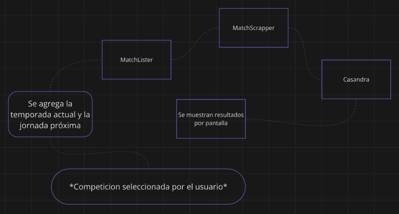

# Casandra

## Motivacion

*Algo irrefutable es que en los partidos de futbol siempre hay un resultado mas probable*.

La premisa principal de Casandra sera **aprovechar el poder del machine learning para predecir resultados y total de goles en partidos de futbol**.

**Casandra** es el nombre que recibira el meta-modelo predictor.

No espero un sistema perfecto, ya que, evidentemente siempre hay una factor de aleatoriedad en los partidos de futbol. Sin embargo, la gran mayoria de partidos tienden a ajustarse a su resultado mas probable.

## Requerimientos

El objetivo es construir una aplicacion de terminal que, al ejecutarse, muestre una lista con las 5 principales ligas europeas, copas ligueras y champions, y al seleccionarse la competicion deseada, *el programa mostrara una lista con todos los partidos de la proxima jornada junto con su resultado mas probable y total de goles mas probable*.

La premisa de este proyecto sera crear dos **meta-modelos** de machine learning capaces de realizar predicciones de partidos de futbol, uno para resultado mas probable (Clasificacion) y otro para la cantidad de goles mas probable (Regresion). Ambos constituiran a **Casandra**.

# Fases del proyecto

## 1- Conseguir datos

* Definir lista de features.

* Crear una funcion que reciba competicion, temporada y jornada y retorne la lista de partidos. (**MatchLister**)

* Crear funcion que, dado un partido y una fecha, retorne los valores para las features seleccionadas y el resultado y goles totales en caso de estar definidos. (**MatchScrapper**)

* Unir ambas funciones anteriores para crear un dataframe y exportar.

## 2 - Entrenamiento de Casandra

Una vez obtenidos los datos, se entrenara Casandra.

## 3 - Juntar modulos para produccion

En produccion se juntaran los modulos **MatchLister**, **MatchScrapper** y **Casandra** para cumplir con los requisitos.

## 4 - Pruebas con casos reales

# Seleccion de features
